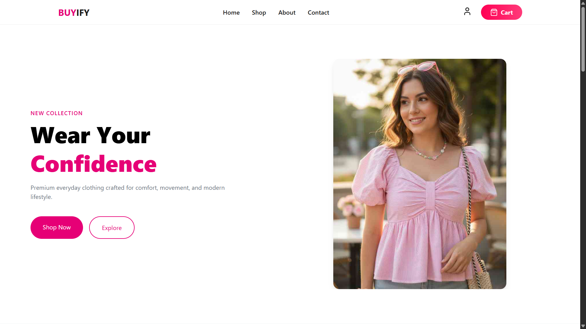
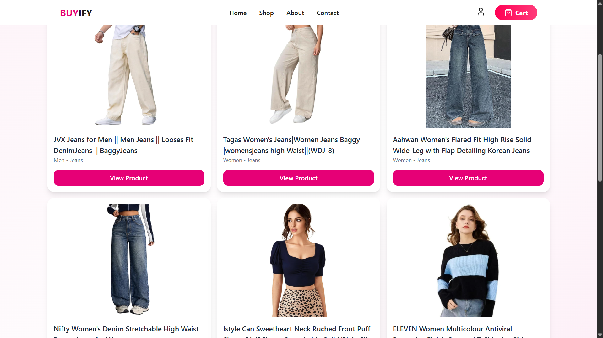
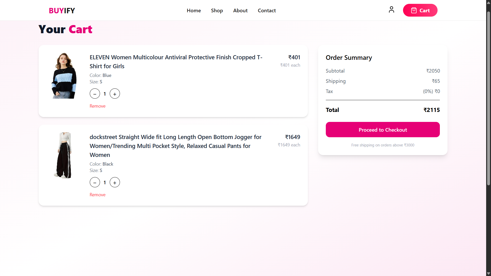

# Buyify – MERN E-Commerce Platform

Buyify is a full-stack clothing e-commerce application built using the MERN stack. It provides a shopping experience for customers and management tools for administrators.

## Live Demo

- **Frontend:** https://buyify-frontend.vercel.app
- **Backend:** https://buyify-backend.onrender.com

## Features

- User authentication with Google OAuth
- Browse clothing products
- Shopping cart and checkout
- Product sizes and stock management
- Razorpay payment integration
- Order placement and tracking
- Admin dashboard for managing products and orders
- Responsive user interface

## Tech Stack

**Frontend**

- React.js
- JavaScript
- Tailwind CSS
- Redux

**Backend**

- Node.js
- Express.js
- MongoDB
- Mongoose
- Google OAuth
- Razorpay

## Screenshots
### Homepage


### Product Listing


### Cart



## Project Structure

```
Buyify-frontend/
├── public/
├── src/
│   ├── components/
│   ├── pages/
│   ├── assets/
│   └── ...
├── package.json
└── README.md
```

## Getting Started

### Prerequisites

- Node.js
- npm

### Installation

1. Clone the repository:

```
git clone https://github.com/ShrutiChauhan24/Buyify-frontend.git
```

2. Navigate to the project folder:

```
cd Buyify-frontend
```

3. Install dependencies:

```
npm install
```

4. Configure the required environment variables in a `.env` file according to your project configuration.

5. Start the development server:

```
npm run dev
```

## Backend

The backend is maintained in a separate repository.

- **Backend Repository:** https://github.com/ShrutiChauhan24/Buyify-backend.git

## Developer

**Shruti Chauhan**
Self-Taught Full-Stack MERN Developer
